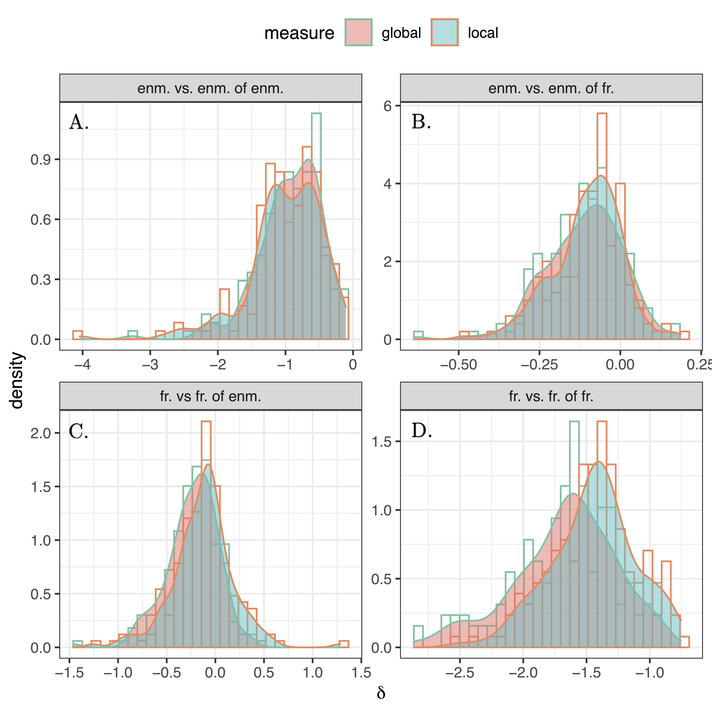

<div style="display: flex; flex-direction: column;">
    <div style="display: flex; justify-content: space-between;">
        <div>
            <h1 style="margin: 0;">The Enmity Paradox</h1>
        </div>
        <div>
            <p>A person’s enemies have more enemies, on average, than a person does.</p>
        </div>
    </div>
    
</div>


> <b>Amir Ghasemian</b>, and Nicholas A. Christakis
> <br><b><a href="https://www.nature.com/articles/s41598-023-47167-9" target="_blank">The Enmity Paradox</a>, Sci Rep 13, 20040 (2023). </b>


<p align="justify">The "friendship paradox" of social networks states that, on average, "your friends have more friends than you do." Here, we theoretically and empirically explore a related and overlooked paradox we refer to as the "enmity paradox." We use empirical data from 24,678 people living in 176 villages in rural Honduras. We empirically show that, for a real negative undirected network (created by symmetrizing antagonistic interactions), the paradox exists as it does in the positive world. Specifically, a person’s enemies have more enemies, on average, than a person does. Furthermore, in a mixed world of positive and negative ties, we study the conditions for the existence of the paradox, which we refer to as the "mixed-world paradox," both theoretically and empirically, finding that, for instance, a person’s friends typically have more enemies than a person does. We also confirm the "generalized" enmity paradox for non-topological attributes in real data, analogous to the generalized friendship paradox (e.g., the claim that a person’s enemies are richer, on average, than a person is). As a consequence, the naturally occurring variance in the degree distribution of both friendship and antagonism in social networks can skew people’s perceptions of the social world.</p>



<figcaption style="text-align: justify;">
    <p align="justify">Histograms of "paradox strengths" ($\delta_g$ and $\delta_l$) for undirected (symmetrized) networks among 176 village networks. The histograms of (pure) enmity and friendship paradoxes are provided in panels A and D, respectively. Other panels represent the histograms of enmity paradox strengths for the mixed worlds. The histogram in panel B shows the global and local paradox distributions for the difference between the number of our enemies and the number of enemies of our friends, while panel C represents the difference between the number of our friends and the number of friends of our enemies.</p>
</figcaption>


### Download the package:
> <p align="left">
> <a href="SampleData/22_signed_networks.zip">Download Data</a>.</p>
> <p align="justify"><a style="pointer-events: none;">This package comprises a selected group of 22 signed networks, representing a fraction of the 176 network villages in Honduras. The data includes the edge list and the corresponding node list of each network.</a></p>

### Instruction for using the package:

<p align="justify"> To load the data:</p>

```python 
import pandas as pd

# Village list (out of 176 villages these villages are released)
village_list = [4, 16, 44, 48, 58, 60, 78, 80, 100, 111, 114, 128, 129, 131, 136, 153, 157, 168, 172, 173, 175, 176]

# Initialize empty DataFrames for nodes and edges
nodes_df = pd.DataFrame(columns=['village', 'node'])
edges_df = pd.DataFrame(columns=['village', 'source', 'target', 'type'])

# Iterate through each village, loading its node and edge list, and append to the DataFrames
for vv in village_list:
    # Correct the file path and variable names, and directly load the CSVs into pandas DataFrames
    node_list_path = f'./22_signed_networks/tfp_vill_{vv}_dir_nodes.csv'
    
    # Assuming the node CSV has a column 'Node' 
    # Adjust column names as per your actual CSV files
    temp_nodes_df = pd.read_csv(node_list_path)
    temp_nodes_df['village'] = vv  # Add a column for village number
    
    nodes_df = nodes_df.append(temp_nodes_df, ignore_index=True)
    
    # Assuming the edge CSV has columns 'Source' and 'Target'
    edge_list_path_p = f'./22_signed_networks/tfp_p_vill_{vv}_dir_edges.csv'
    
    temp_edges_df = pd.read_csv(edge_list_path_p)
    temp_edges_df['village'] = vv  # Add a column for village number
    temp_edges_df['type'] = 'positive'  # Add a column for the type of network
    
    # Append to the main DataFrames
    edges_df = edges_df.append(temp_edges_df, ignore_index=True)
    
    # Assuming the edge CSV has columns 'Source' and 'Target'
    edge_list_path_n = f'./22_signed_networks/tfp_n_vill_{vv}_dir_edges.csv'
    
    temp_edges_df = pd.read_csv(edge_list_path_n)
    temp_edges_df['village'] = vv  # Add a column for village number
    temp_edges_df['type'] = 'negative'  # Add a column for the type of network

    # Append to the main DataFrames
    edges_df = edges_df.append(temp_edges_df, ignore_index=True)

```

### Download the code:
> <p align="left">
> <a >To be updated soon.</a></p>
> <p align="justify"><a style="pointer-events: none;">The package comprises codes to computate the strengths of enmity, friendship, and the mixed-world paradoxes in the paper.</a></p>

### Instruction for running the code:
> <p align="left">
> <a >To be updated soon.</a></p>
> <p align="justify"><a style="pointer-events: none;"></a></p>

### How to cite this work:
<p>If you use this data in your research, please cite it as follows:</p>
<pre>
@article{ghasemian2023enmity,
  title = {The Enmity Paradox},
  author = {Ghasemian, Amir and Christakis, Nicholas A},
  journal = {Scientific Reports},
  volume = {13},
  issue = {1},
  pages = {20040},
  year = {2023}
}
</pre>
