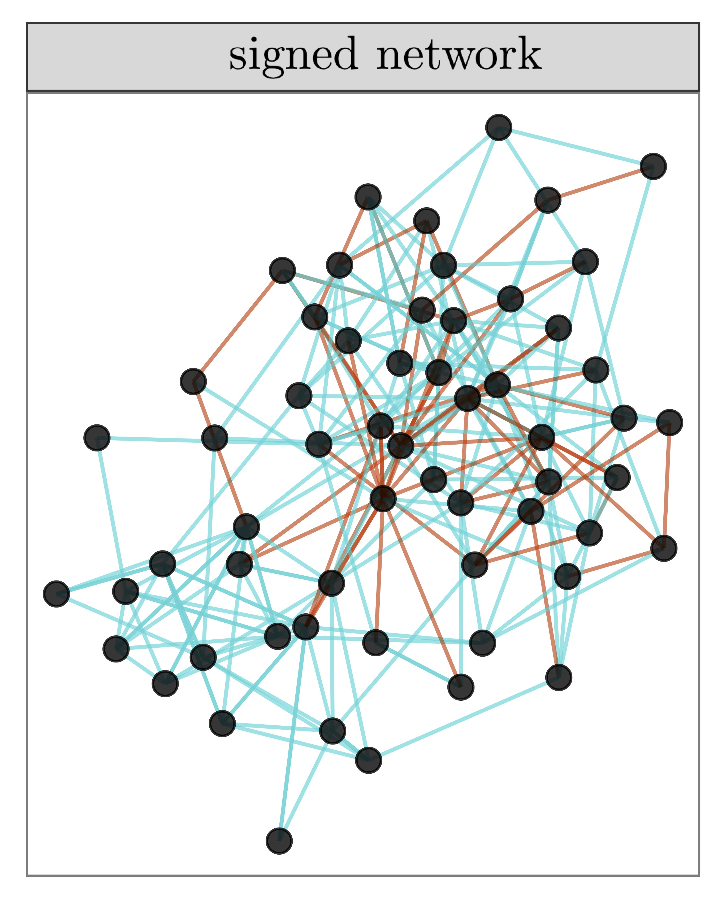
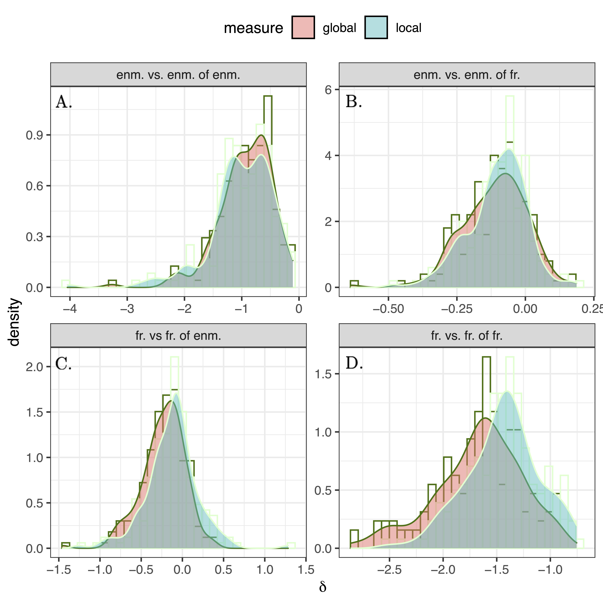

# Enmity Paradox

> 

> <b>Amir Ghasemian</b>, and Nicholas A. Christakis
>  <b><a href="https://www.nature.com/articles/s41598-023-47167-9" target="_blank">The Enmity Paradox</a>, Sci Rep 13, 20040 (2023). </b>
> 

The "friendship paradox" of social networks states that, on average, "your friends have more friends than you do." Here, we theoretically and empirically explore a related and overlooked paradox we refer to as the "enmity paradox." We use empirical data from 24,678 people living in 176 villages in rural Honduras. We empirically show that, for a real negative undirected network (created by symmetrizing antagonistic interactions), the paradox exists as it does in the positive world. Specifically, a person’s enemies have more enemies, on average, than a person does. Furthermore, in a mixed world of positive and negative ties, we study the conditions for the existence of the paradox, which we refer to as the "mixed-world paradox," both theoretically and empirically, finding that, for instance, a person’s friends typically have more enemies than a person does. We also confirm the "generalized" enmity paradox for non-topological attributes in real data, analogous to the generalized friendship paradox (e.g., the claim that a person’s enemies are richer, on average, than a person is). As a consequence, the naturally occurring variance in the degree distribution of both friendship and antagonism in social networks can skew people’s perceptions of the social world.

    

        
        <figcaption class="figure-caption justified-caption">
            Histograms of $\delta_g$ and $\delta_l$ for undirected (symmetrized) networks among 176 village networks. The histograms of (pure) enmity and friendship paradoxes are provided in panels A and D, respectively. Other panels represent the histograms of enmity paradox strengths for the mixed worlds. The histogram in panel B shows the global and local paradox distributions for the difference between the number of our enemies and the number of enemies of our friends, while panel C represents the difference between the number of our friends and the number of friends of our enemies.
        </figcaption>
    

<figcaption style="text-align: justify;">
    Histograms of $\delta_g$ and $\delta_l$ for undirected (symmetrized) networks among 176 village networks. The histograms of (pure) enmity and friendship paradoxes are provided in panels A and D, respectively. Other panels represent the histograms of enmity paradox strengths for the mixed worlds. The histogram in panel B shows the global and local paradox distributions for the difference between the number of our enemies and the number of enemies of our friends, while panel C represents the difference between the number of our friends and the number of friends of our enemies.
</figcaption>

### Download the package:
> 

> <a >To be updated soon.</a>

> 
<a style="pointer-events: none;">This package comprises a selected group of 22 signed networks, representing a fraction of the 176 network villages in Honduras.</a>

### Download the code:
> 

> <a >To be updated soon.</a>

> 
<a style="pointer-events: none;">The package comprises codes to computate the strengths of enmity, friendship, and the mixed-world paradoxes in the paper.</a>

### Instruction for using the package and running the code:
> 

> <a >To be updated soon.</a>

> 

